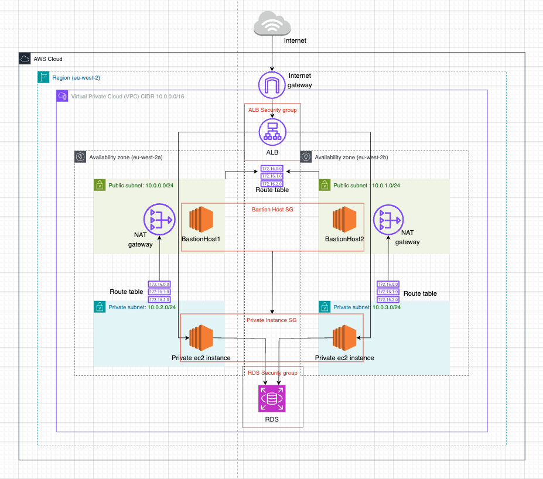
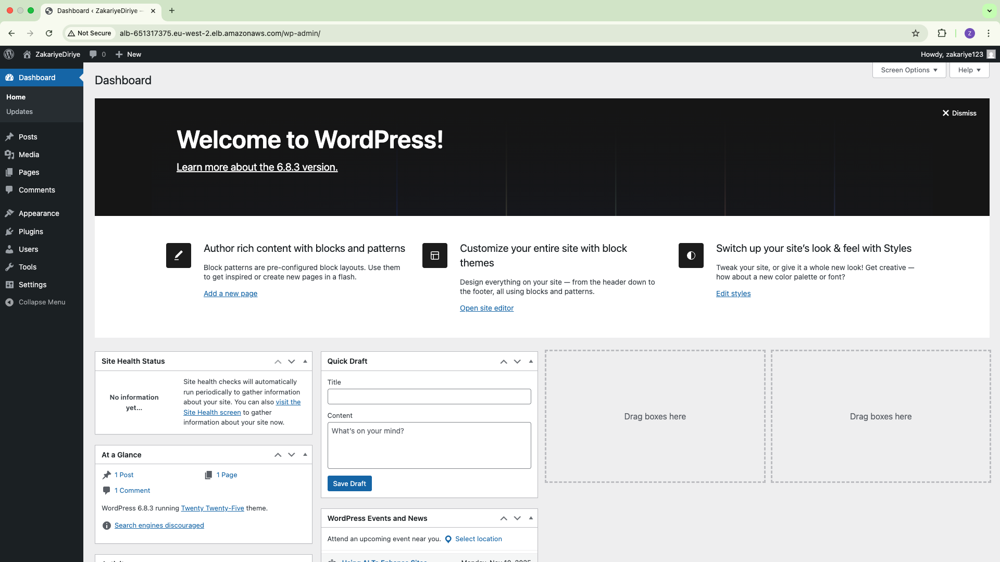

# WordPress deployment on AWS using Terraform

## Project Overview

This project automates the deployment of a **WordPress website** on **AWS** using **Terraform**.

It automatically creates all the required resources such as the VPC, subnets, EC2 instances, load balancer and database.  

## Architecture Diagram

The diagram below shows the overall AWS infrastructure and network design for this deployment:



### Components Explained
- **Public Subnets:** Host Bastion hosts (for SSH access) and NAT Gateways (for private EC2 instances to reach the internet).  
- **Private Subnets:** Contain the EC2 instances running WordPress and the RDS MySQL database.  
- **Application Load Balancer (ALB):** Receives traffic from the internet and forwards HTTP requests to the private EC2 instances.  
- **RDS MySQL:** Runs within private subnets (via a DB Subnet Group). Both EC2 instances connect to it using the database credentials provided by Terraform through cloud init. In the diagram, RDS is shown below the private subnets for clarity, but it is actually deployed inside them as defined in the subnet group.
- **NAT Gateways:** Located in public subnets with Elastic IPs. They allow private EC2 instances to initiate outbound internet connections securely.  
- **Internet Gateway (IGW):** Provides internet connectivity for public resources.  
- **Security Groups (SGs):** Act as stateful firewalls that define allowed inbound and outbound traffic for each resource.  
  - *Example:*  
    - ALB SG → EC2 SG on port **80 (HTTP)**  
    - Bastion SG → EC2 SG on port **22 (SSH)**  
    - EC2 SG → RDS SG on port **3306 (MySQL)**  
---

## Deployment Steps

Before deploying, make sure:
- The latest **Amazon Linux 2023 AMI ID** is updated in private and public EC2 resource block (  ami = "" ).
- A `.tfvars` file exists at the top level of the project with your database credentials:

```hcl
# terraform.tfvars
db_name     = "wordpress"
db_username = "wpadmin"
db_password = "Password123!"
```

Then run the following commands in terminal:
```hcl
terraform init
terraform plan
terraform apply
```
Remember to run terraform destroy to delete the resources created.

## Summary

Using Terraform, I successfully deployed a fully working **WordPress website** on **AWS** with automated infrastructure setup and configuration.



